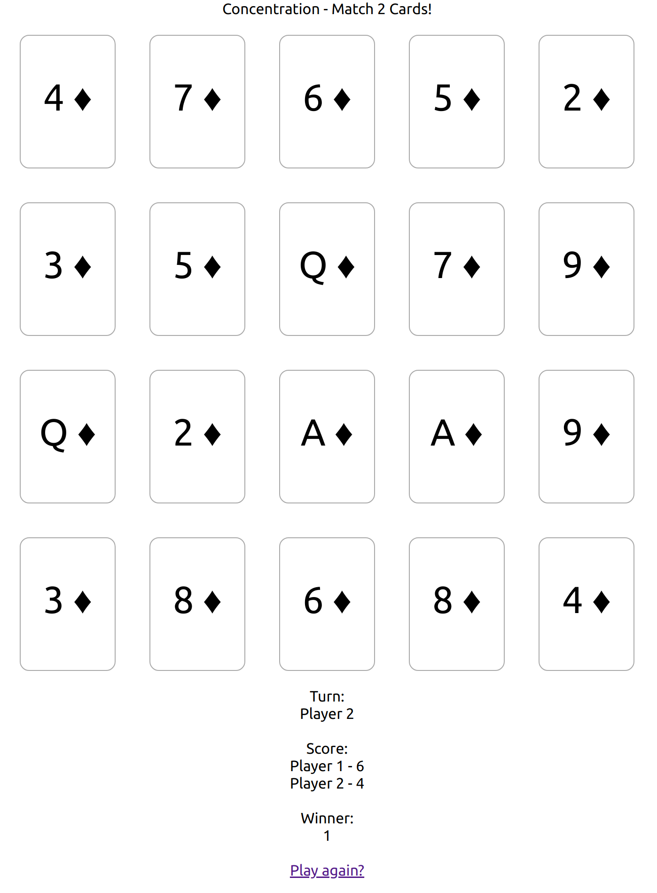

# Concentration
Choose two cards to flip until all pairs have been found.

The game is implemented by shuffling 10 pairs of cards and tracking them in the state. Then two useEffect hooks are used to render changes.

### `npm start`

Runs the app in the development mode.\
Open [http://localhost:3000](http://localhost:3000) to view it in the browser.

### `npm test`

Runs tests

